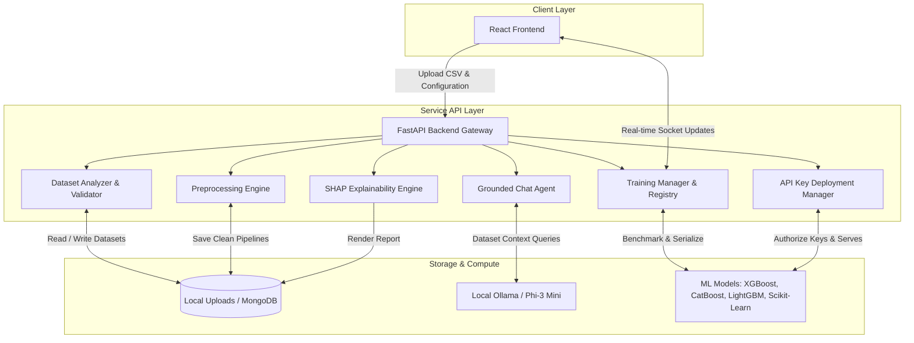

```
███╗   ██╗    ███████╗    ██╗  ██╗     ██████╗     ██████╗      █████╗
████╗  ██║    ██╔════╝    ╚██╗██╔╝    ██╔═══██╗    ██╔══██╗    ██╔══██╗
██╔██╗ ██║    █████╗       ╚███╔╝     ██║   ██║    ██████╔╝    ███████║
██║╚██╗██║    ██╔══╝       ██╔██╗     ██║   ██║    ██╔══██╗    ██╔══██║
██║ ╚████║    ███████╗    ██╔╝ ██╗    ╚██████╔╝    ██║  ██║    ██║  ██║
╚═╝  ╚═══╝    ╚══════╝    ╚═╝  ╚═╝     ╚═════╝     ╚═╝  ╚═╝    ╚═╝  ╚═╝
```

# Nexora — Autonomous AI Predictive Analytics Platform

An autonomous predictive analytics platform that profiles datasets, builds optimized preprocessing pipelines, trains reproducible model registries, runs batch predictions, monitors feature drift, and provides grounded AI educational interactive chats from a single CSV upload.


---

[](https://github.com/jeet2005/Nexora/actions/workflows/ci-backend.yml)
[](https://github.com/jeet2005/Nexora/actions/workflows/ci-frontend.yml)
[](https://github.com/jeet2005/Nexora/stargazers)
[](https://github.com/jeet2005/Nexora/issues)
[](LICENSE)
[](CONTRIBUTING.md)
[](https://fastapi.tiangolo.com/)
[](https://www.python.org/)
[](https://scikit-learn.org/)
[](https://xgboost.ai/)
[](https://lightgbm.ai/)
[](https://catboost.ai/)
[](https://github.com/slundberg/shap)
[](https://reactjs.org/)
[](https://www.typescriptlang.org/)
[](https://recharts.org/)
[](COMPLETION_STATUS.md)

---

## Why Nexora?

Data scientists and developers often spend hours writing repetitive code for data profiling, exploratory analysis, preprocessing, model benchmarking, and production endpoint deployments. Nexora bridges this gap by serving as a unified prediction engine. 

By uploading a single dataset (supporting CSV, Excel, Parquet, JSON, JSONL, TSV, HTML, XML, Feather, ORC, Stata, SAS, SPSS, SQL, Pickles, HDF5, and 100+ more formats), developers can instantly audit dataset health, clean features, benchmark leading machine learning models side-by-side, analyze SHAP explainability insights, download compiled PDF reports, converse with a grounded AI dataset assistant, export trained models (.joblib), and deploy production-ready prediction API endpoints secured by unique API keys.

---

## Key Features - Full Terminal Parity!

[*] Interactive CLI Wizard - Same 9-stage workflow as web, no browser needed
[*] Full Terminal Access - `nexora train`, `nexora predict`, `nexora explain`, `nexora cluster`, `nexora forecast`
[*] Python Library - Import Nexora in scripts for automation
[*] 100+ Data Formats - CSV, Excel, Parquet, SQL, MongoDB, S3, Google Sheets, scikit-learn datasets
[*] 6 ML Families - Linear, Tree-based, Boosting (XGB/LGBM/CatBoost), Neural Networks, Ensemble
[*] Auto Preprocessing - Missing imputation, encoding, scaling, outlier handling, deduplication
[*] SHAP Explanations - Feature importance, what-if analysis, decision drivers
[*] Deployment - FastAPI, Flask, Streamlit, Docker, Jupyter export  

### Quick Command Examples
```bash
nexora                                    # Interactive wizard
nexora train data.csv --target revenue   # Train models
nexora predict model.nx new_data.csv     # Make predictions
nexora explain model.nx                  # Feature importance
nexora serve model.nx --port 8000        # REST API
```

**No web browser required. Everything in the terminal!** See [CLI_FEATURES.md](CLI_FEATURES.md) for all commands.

---

## Live Deployments

| Component | URL | Host Provider |
| :--- | :--- | :--- |
| **Frontend Web App** | [nexoraprediction.netlify.app](https://nexoraprediction.netlify.app/) | Netlify |
| **Backend API** | [nexora-360r.onrender.com](https://nexora-360r.onrender.com/) | Render |
| **API Documentation** | [nexora-360r.onrender.com/docs](https://nexora-360r.onrender.com/docs) | Render |

*Note: The backend API runs on Render's free tier and spins down after periods of inactivity. Please allow 30 to 60 seconds for the initial cold start when first accessing the application.*

*Note: The educational assistant (Ollama integration) requires a local Ollama instance and is only active when running the application locally. See local setup guidelines below.*

---

Visit the frontend demo page at `/how_nexora_works.html` to learn how Nexora works, including monitoring and drift detection features.

## System Architecture

The diagram below outlines the end-to-end data flow, processing components, and communication layers in Nexora:



---

## Core Features

### 1. Dataset Intelligence Engine
* **Automated Multi-Format Validation** - Handles CSV, Excel, Parquet, JSON, and 100+ tabular file formats. Formats columns, assesses size boundaries, and verifies integrity.
* **Health Profiling** - Evaluates structural completeness, statistical anomalies, and generates per-column scorecards.
* **Preview and Distributions** - Offers statistical summaries, skew metrics, and categorical balance diagnostics.

### 2. Dynamic Preprocessing Pipelines
* **Type Parsing** - Separates numerical parameters, categorical labels, datetimes (with enhanced Unix timestamp detection), and identifier variables.
* **Intelligent Preprocessing** - Implements missing values imputation, standard scaling, target-label encoding, outlier detection, and duplicate record cleaning.
* **Interactive Configuration** - Provides controls to select prediction targets and customize individual preprocessing steps.

### 3. Prediction Studio and Benchmarking
* **Model Registry** - Supports multiple algorithms including XGBoost, CatBoost, LightGBM, and Scikit-Learn ensembles.
* **Training Pipeline** - Executes cross-validation splits, train-test isolation, and hyperparameter parameter sweeps.
* **WebSocket Leaderboard** - Streams active model training metrics and charts real-time scores directly to the UI.
* **Comparison Arena** - Visualizes metrics, prediction drift charts, and latency histograms of trained models.

### 4. Interactive Data Visualization
* **Multi-Chart Dashboard** - Displays numerical trends, categorical patterns, and completeness heatmaps.
* **Data Health Visualization** - Compiles data quality stats, missing records rates, and unique features counts.
* **Correlation Insights** - Flags linear dependencies, high associations, and outlier counts.

### 5. Production Suite
* **Model Export** - Easily download compiled `.joblib` model artifacts for offline use.
* **API Endpoints** - Deploys production-grade prediction endpoints secured by custom API keys.
* **Batch Processing** - Enables bulk uploads to retrieve fully enriched output prediction sheets.
* **Drift Detection** - Compares historical prediction request signatures to highlight potential target concept drift.
* **Grounded LLM Chat** - Integrates local Ollama models (Phi-3 Mini) to act as a database context tutor answering questions regarding data distribution trends.

---

## Technical Stack

| Layer | Technologies |
| :--- | :--- |
| **Frontend Web App** | React 18, Vite, TypeScript, Tailwind CSS, Framer Motion, Recharts, Axios, Lucide Icons |
| **Backend Service API** | Python 3.11, FastAPI, Uvicorn, Pydantic, Pandas, NumPy, Scikit-learn, CatBoost, LightGBM, XGBoost |
| **Data Persistence** | MongoDB Atlas / Local File Storage |
| **Local LLM Integration** | Ollama Engine (Phi-3 Mini) |
| **Infrastructure Platforms** | Netlify (Frontend), Render (Backend) |

---

## Local Development

### Installation Prerequisites

| Dependency | Minimum Version |
| :--- | :--- |
| Python | 3.11 or higher |
| Node.js | 20 or higher |
| npm | 10 or higher |
| Ollama | Latest (optional, for grounded Q&A) |

### Development Option 1: Standard Installation

#### 1. Clone the Project
```bash
git clone https://github.com/jeet2005/Nexora.git
cd Nexora
```

#### 2. Configure Backend Service
```bash
cd backend
python -m venv .venv

# Activate Virtual Environment (Windows)
.venv\Scripts\activate

# Activate Virtual Environment (macOS / Linux)
source .venv/bin/activate

# Install dependencies and setup configuration
pip install -r requirements.txt
cp .env.example .env

# Run development server
python run.py
```
The backend service will be available at `http://localhost:8000`. You can test endpoints on Swagger UI at `http://localhost:8000/docs`.

#### 3. Configure Frontend Application
```bash
cd ../frontend
npm install
cp .env.example .env.local

# Run development server
npm run dev
```
The React frontend application will be active at `http://localhost:5173`.

---

### Development Option 2: Docker Compose Setup

Run the entire stack (FastAPI, React, and MongoDB) with a single command:

```bash
docker compose up --build
```

* **Frontend Web App**: Access at `http://localhost:3000`
* **Backend API**: Access at `http://localhost:8000`
* **MongoDB Instance**: Running on port `27017`

---

### Development Option 3: Makefile Shortcuts

If you have Make installed, you can orchestrate development commands directly from the project root:

* Install all package dependencies: `make install`
* Launch backend locally: `make dev-backend`
* Launch frontend locally: `make dev-frontend`
* Run backend pytest suite: `make test`
* Format all file types: `make format`
* Spin up Docker containers: `make docker-up`
* Spin down Docker containers: `make docker-down`

---

## Grounded Q&A Assistant Setup (Optional)

To enable the dataset assistant using a local LLM instance:

1. Download and install [Ollama](https://ollama.com/).
2. Pull the default micro-LLM model in your terminal:
   ```bash
   ollama pull phi3:mini
   ```
3. Keep Ollama active in the background. The assistant will detect local hosting at `http://localhost:11434` and enable custom educational conversations.

---

## Repository Roadmap

- [ ] Add Pytest code coverage reports in the Backend CI pipeline.
- [ ] Implement multi-file comparison dashboards within the Frontend page.
- [ ] Add support for automated time-series forecasting hyperparameter tuning.
- [ ] Integrate PostgreSQL database schema mappings for enterprise persistence layers.
- [ ] Add REST API key rotation options inside the Production UI.
- [ ] Create automated end-to-end integration tests using Playwright.

---

## Contributing and Governance

Contributions are welcome. Please read our [Contributing Guidelines](CONTRIBUTING.md) to understand branch conventions, pull request structures, and developer standards. Ensure all contributions align with our [Code of Conduct](CODE_OF_CONDUCT.md).

For vulnerability notifications, refer to our [Security Policy](SECURITY.md).

---

## License

Nexora is open-source software licensed under the [MIT License](LICENSE).
